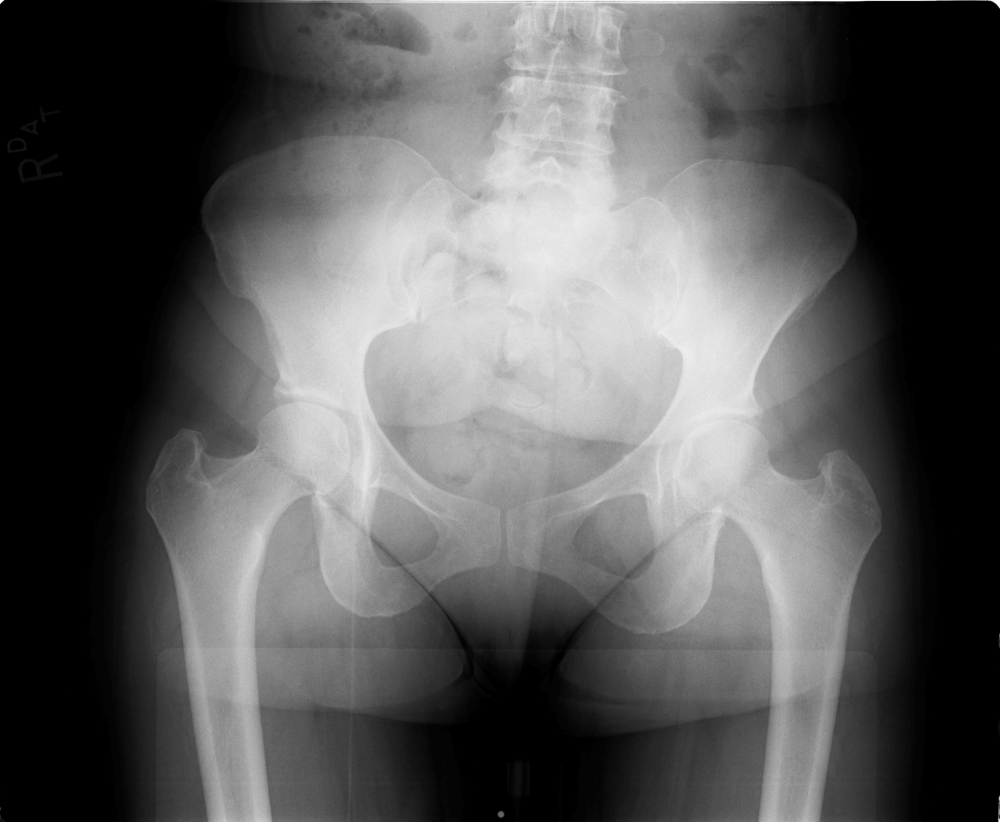
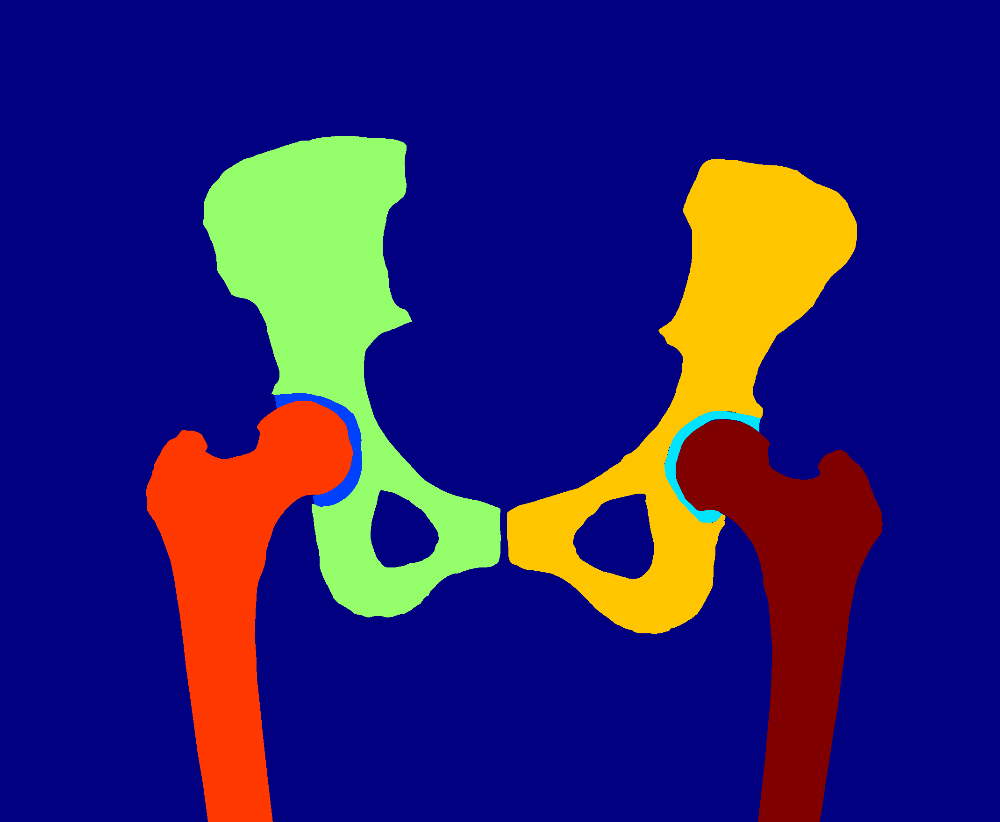

# HexAI Research Laboratory: Computer Vision Challenge
## Mitigating Bias Between Race and Sex in Hip Bony Anatomy Segmentation

### Problem Statement
AI-powered segmentation of the hip bony anatomy has revolutionized orthopedics, transforming both pre-operative planning and post-operative assessment. However, a critical issue remains largely unexplored: the potential for biases inherent within these AI-powered models. This challenge addresses this critical concern by examining deep
learning-driven hip bony anatomy segmentation using plain radiographs, with a specific focus on identifying and addressing discernible biases related to sex and race. 

 

### Dataset
The dataset for this challenge can be downloaded from [this link](https://github.com/littlefieldnick/PittHexAI_ComputerVisionChallenge_V1/raw/main/data/HexAI_CV_Challenge_HipSeg_Feb2024.zip?download=). Inside you will find two folders:
- Images/ : Directroy containing DICOM files containing individual hip x-rays.
- Annotations/ : Directory containing manually annotated segmentation masks for the hip.
- hip_sample_Feb2024.csv : CSV containing patient ids and related demographic information

#### Hip Bony Anatomy Classes

| Class | Label      |
|-------|------------|
| 0     | Background |
| 1     | R Acetabulum  |
| 2     | L Acetabulum   |
| 3     | R Ilium, Ischium, and Pubis   |
| 4     | L Ilium, Ischium, and Pubis  |
| 5     | R Femur  |
| 6     | L Femur    |

## Part 1: Computational Tasks
1. Using the provided data, please generate two models few-shot models, one using 10 samples and one using 25. These will be your baseline models for bias compairison.
2. For your baseline models calculate the Intersection over Union (IoU). Along with this, calculate the bias between different sex and racial groups using the Skewed Error Ratio (SER) and **two additional** bias metrics of your choice.
3. Generate models to mitigate the sex and racial bias discovered in the previous step using stratified, balanced, group-specific and **one additional bias mitigation** techniques.
4. Evalute the IoU for each bias mitigation techniques. Evaluate the bias of each technique using SER and the **two additional** bias metrics you chose. 

**Additional Requirement: All code should be written in Python and PyTorch**

## Part 2: For this part please answer the following questions explaining it. Your analysis for this part is more important than the correctness of your answers
1. Your model demonstrates improved accuracy on the test set, but how does it perform on unseen data, especially images from different demographic groups or with rare pathologies? Discuss the model's generalization capabilities and any steps taken to ensure it remains robust across diverse clinical scenarios.
2. After applying different bias mitigation techniques, how does each technique affect Intersection over Union (IoU)? Please analyze the effectiveness of these techniques in reducing bias and their impact on the overall performance of the model, including any trade-offs or unintended consequences that arise.
3. In deep learning models, especially those used for image segmentation, latent biases may affect the decision-making process at subtle levels. Explore how advanced model interpretability tools and techniques, such as adversarial sample generation and layer-wise analysis, can reveal and quantify these hidden biases. Discuss the challenges of implementing these techniques and their impact on the model development process.
4. When your model exhibits higher accuracy on datasets with complex, intersecting features of race and sex, how can you deeply analyze the model's capability in handling these intersecting characteristics? Discuss the strengths and limitations of the model in processing highly heterogeneous group data, and explore potential strategies to enhance model performance in these scenarios.

## Submission Requirements
1. Write a detailed report analyzing the results (Part1 and Part2 should be all included in you report). The report **must** also include a description of each of the additional bias metrics you chose to implement. It **must** also include a description of the additonal alternative bias mitigation technique utilized. 
2. Upload your code and results to this repo.

## Due Date
The due date of this challenge is Friday, March 1st, 11:59 pm EDT. 
